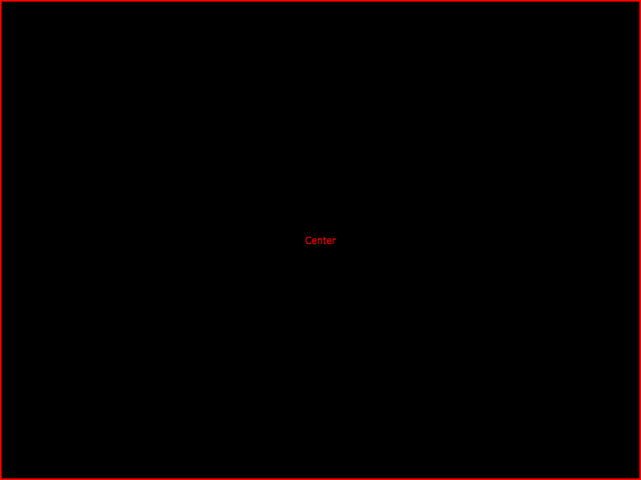
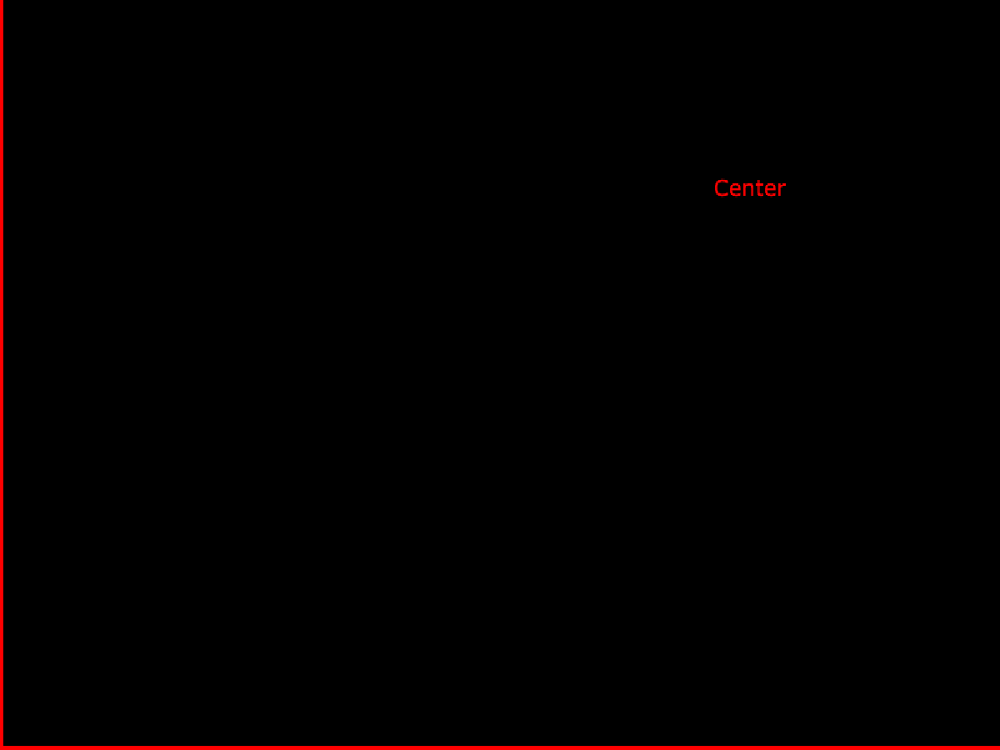

# Build:
```
git submodule update --init --recursive

cmake -B build -D CMAKE_BUILD_TYPE=Debug
cmake.exe --build build --config Debug
```

# Results

## Win 10, Bitwig 3.3, 100% Display Scaling


## Win 10, Bitwig 3.3, 150% Display Scaling

